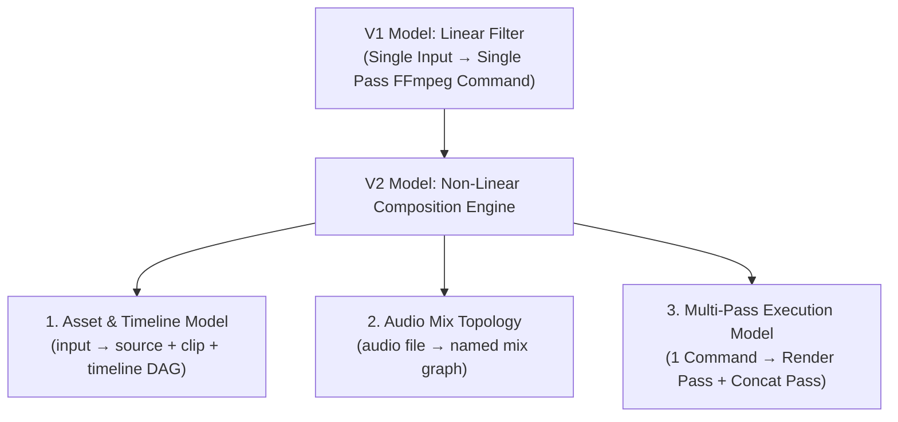

# V2 Breaking Changes & Migration Guide

This document covers every breaking change introduced by Kurenai V2, explains the core technical rationale behind each decision, and provides concrete before/after examples to help you migrate existing scripts and integrations.

---

## Executive Summary: Why V2 Requires Breaking Changes

Kurenai V1 was built as a **Linear Media Filter DSL**. Its execution model assumed a 1:1 single-input pipeline: one input file (`input "file.mp4"`), a set of global transformation filters (resizing, fps, encoding, watermarking), and one single-pass output file generated via a single FFmpeg CLI command.

V2 transforms Kurenai from a linear filter generator into a **Non-Linear Composition Engine (NLE Compiler)**. V2 enables users to declare multiple heterogeneous source assets, trim arbitrary time-ranged clips, sequence clips onto an ordered timeline, and mix complex multi-track audio graphs with independent gain controls.

Shifting from a linear filter to a non-linear composition compiler created fundamental impossibilities within the V1 language grammar, AST representation, and code generator. Supporting NLE capabilities demanded breaking changes across three primary architectural pillars:



### 1. Asset & Composition Model (`input` → `source` / `clip` / `timeline`)
* **V1 Limitation:** A global `input "file"` statement restricts compilation to a single input stream. It cannot express stitching clip A (from source 1) and clip B (from source 2) into a unified timeline.
* **V2 Architectural Shift:** Asset registration is decoupled from timeline sequencing. Media inputs are declared as named `source` nodes, sliced into reusable `clip` entities with start/end trim offsets (`from ... to`), and ordered inside an explicit `timeline` block.

### 2. Audio Mix Topology (`audio` block → `mix` block)
* **V1 Limitation:** V1's `audio { file "bg.mp3" }` syntax could only overlay a single background file with global settings. It lacked support for multi-channel track blending, independent volume gain control, or routing multiple audio streams.
* **V2 Architectural Shift:** Named `mix` blocks allow multi-track composition with per-track gain control (`track background volume 0.5`). To prevent syntax collision and enforce strict AST validation, `audio IDENTIFIER` was redefined to reference a declared `mix` symbol rather than a file path.

### 3. Code Generation & Execution Model (1 Command → Multi-Pass Pipeline)
* **V1 Limitation:** V1 assumed `1 output statement = 1 FFmpeg CLI command`.
* **V2 Architectural Shift:** Performing frame-accurate trim seeking across multiple heterogeneous media files within a single FFmpeg filtergraph creates severe performance bottlenecks, timestamp drift, audio desynchronization, and filtergraph complexity limits. V2 adopts a deterministic **Two-Pass Execution Strategy**:
  * **Pass 1 (Segment Extraction):** Render each timeline clip segment to an intermediate file (`ffmpeg -ss ... -to ...`).
  * **Pass 2 (Concat Assembly & Mixing):** Combine rendered segments via FFmpeg's `-f concat` demuxer and apply `amix` audio mixing filtergraphs.

### Non-Breaking Opt-in Mechanics (`use v2`)

Because V2 fundamentally alters the grammar and AST schema, V2 is strictly **opt-in**:
* All existing V1 scripts continue to execute without modification.
* V2 mode is explicitly triggered by placing `use v2` as the **first line** of a `.crn` script.
* The compiler pipeline (lexer, parser, analyzer, codegen) branches conditionally upon encountering `use v2`, ensuring complete isolation from V1 code paths.

---

## Table of Contents

1. [No `input` keyword in V2](#1-no-input-keyword-in-v2)
2. [No top-level output without a timeline](#2-no-top-level-output-without-a-timeline)
3. [`audio` keyword semantics changed](#3-audio-keyword-semantics-changed)
4. [AST shape change — `Program` → `ProgramV2`](#4-ast-shape-change--program--programv2)
5. [`compile()` return type widened](#5-compile-return-type-widened)
6. [`analyze()` / `generate()` / `explain()` signatures widened](#6-analyze--generate--explain-signatures-widened)
7. [Code generation — multi-command output](#7-code-generation--multi-command-output)
8. [Reserved identifiers](#8-reserved-identifiers)
9. [New token type: `FLOAT`](#9-new-token-type-float)
10. [Parser architecture — new `*Parser` classes](#10-parser-architecture--new-parser-classes)
11. [Full migration checklist](#11-full-migration-checklist)

---

## 1. No `input` keyword in V2

### What changed

V1 uses a single `input "file"` statement to declare the source file.  
V2 replaces this with **named `source` declarations** so that multiple inputs can be used within one script.

### V1 (still works)

```kurenai
input "video.mp4"
output "out.mp4"
```

### V2 equivalent

```kurenai
use v2

source main "video.mp4"

clip c from main 0s to 60s

timeline { c }

output "out.mp4"
```

### Why (Architectural Rationale)

* **Multi-Input Support:** A single global `input` keyword creates an implicit 1:1 binding between the DSL script and a single file on disk. This makes multi-source timelines (such as stitching an intro video, a main feature, and an outro video) structurally impossible to express.
* **Symbol Resolution & Semantic Analysis:** `source` declarations establish explicit named identifiers (e.g. `source main "video.mp4"`). This allows the compiler's semantic analyzer to validate asset references, check for duplicate source names, and confirm that every `clip` targets a valid, declared `source` before emitting any FFmpeg commands.
* **Decoupling File Registration from Time Slicing:** In V1, the file path was bound directly to global filters. In V2, asset registration (`source`) is decoupled from time trimming (`clip`), enabling a single source file to be sliced into multiple non-contiguous clips without redundant file declarations.

> [!WARNING]
> Using `input` inside a `use v2` script will throw a parse error:
> ```
> Unknown keyword: input  (line 3)
> ```

---

## 2. No top-level output without a timeline

### What changed

In V1 you can have `output` without any clip structure. In V2, if you declare any `clip`, you **must** also declare a `timeline`. An `output` without a `timeline` passes the parser but fails the analyzer.

### Analyzer error

```
Timeline is required when clips are defined.
```

### V2 correct pattern

```kurenai
use v2

source a "a.mp4"

clip c_a from a 0s to 30s

timeline { c_a }   ← required

output "out.mp4"
```

### Why (Architectural Rationale)

* **Eliminating Ordering Ambiguity:** Clips in V2 are independent declarations. Without a `timeline` block specifying the explicit sequence (e.g., `timeline { clip1, clip2 }`), the compiler cannot infer the playback order, clip repetition, or overall composition structure.
* **Deterministic Concat Graph Building:** FFmpeg's `-f concat` demuxer requires an ordered list of segments. The `timeline` block provides the single source of truth for generating the `segments.txt` manifest.
* **Preventing Unintended Output:** Requiring an explicit `timeline` when clips are declared prevents subtle user errors where clips are defined in script memory but forgotten during final assembly.

> [!NOTE]
> If you declare **no clips** (e.g. a V2 script that only uses `encode`/`bitrate` globals), a `timeline` is not required and no concat pass is generated.

---

## 3. `audio` keyword semantics changed

### What changed

| Context | V1 behaviour | V2 behaviour |
|---|---|---|
| `audio { … }` block | Configures codec, bitrate, EQ, normalize, etc. | **Unchanged** — still valid |
| `audio IDENTIFIER` | References an external file to mix in | **References a named `mix` block** |

In V2, `audio bg` means "use the mix named `bg`" — not a file path. Referencing a name that was not declared with `mix` throws:

```
Audio mix "bg" not found.
```

### V1 (external file mix)

```kurenai
audio {
  file "background.mp3"
}
```

### V2 equivalent

```kurenai
mix bg {
  track background volume 0.5
}

audio bg
```

### Why (Architectural Rationale)

* **Multi-Track Gain & Layering:** Plain file path strings cannot express per-track volume adjustments, fade curves, or multi-track balance rules. V2 audio mixing requires blending multiple source tracks at independent gain levels using FFmpeg's `amix` filter graph.
* **Decoupling Mix Definition from Output Binding:** Named `mix` blocks isolate audio composition logic (`mix bg { track ... volume 0.5 }`) from the output block (`audio bg`). This allows a single complex audio mix configuration to be reused across multiple output targets.
* **Strict Symbol Checking:** Requiring `audio IDENTIFIER` to match a declared `mix` symbol enables static semantic validation during `analyzeAst()`, catching misspelled mix names at compile-time rather than failing during FFmpeg execution.

> [!CAUTION]
> `audio "background.mp3"` (string argument) is **not** valid in V2. Only an identifier referencing a declared `mix` is accepted.

---

## 4. AST shape change — `Program` → `ProgramV2`

### What changed

V1 scripts parse into a `Program` object. V2 scripts parse into a `ProgramV2` object. The two share the `type: 'PROGRAM'` discriminant but have different fields.

**`Program`** (V1) — key fields:

```ts
interface Program {
  type: 'PROGRAM';
  input?:     InputNode;
  outputs:    OutputNode[];
  encode?:    EncodeNode;
  resize?:    ResizeNode;
  // …etc
}
```

**`ProgramV2`** (V2) — key fields:

```ts
interface ProgramV2 {
  type:     'PROGRAM';
  version:  2;               // ← discriminant field
  sources:  Record<string, SourceNode>;
  clips:    Record<string, ClipNode>;
  mixes:    Record<string, MixNode>;
  timeline: TimelineNode | null;
  outputs:  OutputNode[];
  encode?:  EncodeNode;
  // …same shared V1 fields
}
```

### How to distinguish at runtime

Use the `version` field as a discriminant:

```ts
import { compile, type ProgramV2 } from "@arafat2020/kurenai";

const { ast } = compile(source);

if ('version' in ast && ast.version === 2) {
  const v2 = ast as ProgramV2;
  console.log(v2.sources);   // Record<string, SourceNode>
  console.log(v2.timeline);  // TimelineNode | null
} else {
  // V1 Program
}
```

### Why (Architectural Rationale)

* **Relational Graph vs. Flat Pipeline:** V1 AST (`Program`) was a flat struct containing optional single-node properties (`input?`, `resize?`). V2 AST (`ProgramV2`) is a relational graph containing symbol dictionaries (`sources`, `clips`, `mixes`) and an execution graph (`timeline`).
* **Type Safety & Preventing Undefined Access:** Merging V2 dictionary properties onto the V1 `Program` interface would create an ambiguous, error-prone type definition where fields like `sources` or `input` might silently be `undefined` depending on script version. Splitting into `Program` and `ProgramV2` with a `version: 2` discriminant enforces compile-time type safety for TypeScript consumers.

> [!IMPORTANT]
> Never discriminate on the presence of `sources` or `clips` alone — these fields do not exist on `Program` and will be `undefined`, not empty objects.

---

## 5. `compile()` return type widened

### What changed

```diff
- CompileResult { ast: Program;    commands: string[] }
+ CompileResult { ast: Program | ProgramV2; commands: string[] }
```

### Migration

If your code accesses `ast.input` (V1-only field), add a guard:

```ts
const { ast } = compile(source);

// Before (V1-only code — unsafe now)
console.log(ast.input.file);           // ← TypeScript error

// After — guard first
if (!('version' in ast)) {
  console.log(ast.input?.file);        // ✓ safe V1 path
}
```

### Why (Architectural Rationale)

* **Single Pipeline Entrypoint:** The unified `compile()` API processes both V1 and V2 source code based on header inspection (`use v2`). Because the parser returns `Program` for V1 and `ProgramV2` for V2, the return type must represent the union (`Program | ProgramV2`).
* **Enforcing Runtime Guarding:** Widening the return type forces TypeScript consumers to explicitly narrow the AST type using `if ('version' in ast && ast.version === 2)`, preventing runtime `TypeError` exceptions when attempting to access V1 properties on V2 programs (or vice-versa).

---

## 6. `analyze()` / `generate()` / `explain()` signatures widened

### What changed

All four public pipeline functions now accept `Program | ProgramV2`:

```diff
- analyze(program: Program): void
+ analyze(program: Program | ProgramV2): void

- generate(program: Program): string[]
+ generate(program: Program | ProgramV2): string[]

- explain(program: Program): void
+ explain(program: Program | ProgramV2): void
```

This is **backward-compatible** — a `Program` value is still valid. However, if you were calling these functions with a value typed as `Program` from a compile result, TypeScript will now require you to narrow the union first or cast explicitly.

```ts
import { lex, parse, analyzeAst, generateCommands } from "@arafat2020/kurenai";

const ast = parse(lex(source));  // Program | ProgramV2
analyzeAst(ast);                 // ✓ works for both
const cmds = generateCommands(ast);
```

### Why (Architectural Rationale)

* **Polymorphic Pipeline Design:** Internal pipeline stages (Analyzer, Codegen, Explain) were refactored into polymorphic dispatchers. `analyze(ast)` delegates internally to `analyzeV1(ast)` or `analyzeV2(ast)` based on the version discriminant. Widening the parameter types allows downstream tools to pass AST objects directly through the pipeline without manual casting.

---

## 7. Code generation — multi-command output

### What changed

V1 always emits **one FFmpeg command per output**.  
V2 emits **multiple FFmpeg commands per output** via a two-pass strategy:

| Pass | Commands |
|---|---|
| **Pass 1** | One `ffmpeg -ss … -to …` render command per clip in timeline order |
| **Pass 2** | One `ffmpeg -f concat` assembly command per `output` statement, with optional `amix` audio filter |
| **Pass 3** _(optional)_ | One `ffmpeg -frames:v 1` thumbnail extraction command |

### V1 output (1 command)

```bash
ffmpeg -i video.mp4 -vf "scale=1920:1080" -c:v libx264 -c:a aac out.mp4
```

### V2 output (N + 1 commands)

```bash
# Pass 1 — per clip
ffmpeg -ss 0 -to 10 -i intro.mp4 -c:v libx264 -c:a aac segment_c_intro.mp4
ffmpeg -ss 5 -to 45 -i main.mp4  -c:v libx264 -c:a aac segment_c_main.mp4

# segments.txt contents (inline comment in output):
# file segment_c_intro.mp4
# file segment_c_main.mp4

# Pass 2 — concat
ffmpeg -f concat -safe 0 -i segments.txt \
  -i bg.mp3 \
  -filter_complex "[1:a]volume=0.5[t1];[t1]amix=inputs=1:duration=longest[aout]" \
  -map 0:v -c:v copy -map [aout] -c:a aac final.mp4
```

### Why (Architectural Rationale)

* **FFmpeg Technical Limitations with Single-Pass Multi-Source Trimming:** Attempting to seek, trim, scale, and concatenate multiple heterogeneous input sources within a single FFmpeg `filter_complex` command causes severe issues:
  1. **Seeking Latency & Frame Accuracy:** Input seeking (`-ss` before `-i`) is fast but inaccurate if done inline inside complex filter graphs, leading to black frames or missing keyframes.
  2. **Timestamp Desynchronization:** Complex trim filter graphs (`[0:v]trim=0:10,setpts=PTS-STARTPTS[v0]`) frequently desynchronize audio and video streams over multi-clip timelines.
  3. **Command Line Overflow & Filtergraph Complexity:** Multi-clip timelines with individual filters lead to unmaintainable, multi-kilobyte FFmpeg filter strings that breach shell command length limits and trigger internal FFmpeg buffer overflows.
* **Benefits of Two-Pass Architecture:**
  * **Pass 1 (Pre-rendering Segments):** Extracts exact timestamp clips independently using fast stream copy or uniform encoding, outputting clean, standardized intermediate segment files (`segment_<name>.mp4`).
  * **Pass 2 (Concat Demuxer):** Uses FFmpeg's ultra-fast, zero-reencode `-f concat` demuxer to stitch intermediate segments together seamlessly before applying final audio mixing.

> [!WARNING]
> Any code that assumes `commands.length === outputs.length` will break for V2 scripts. Always iterate over the full `commands` array rather than assuming a fixed count.

### `segments.txt` generation

The concat pass requires a `segments.txt` input list. Kurenai emits the file contents as a comment block inline in the command output (prefixed with `# Write to segments.txt:`). You are responsible for writing this file before running the concat command. A typical shell integration:

```bash
# 1. Render clips (commands[0] … commands[N-1])
ffmpeg -ss 0 -to 10 -i intro.mp4 … segment_c_intro.mp4

# 2. Write the concat list
cat > segments.txt << 'EOF'
file segment_c_intro.mp4
file segment_c_main.mp4
EOF

# 3. Concat + mix (last command)
ffmpeg -f concat -safe 0 -i segments.txt …
```

---

## 8. Reserved identifiers

The following identifiers are **reserved** in V2 and cannot be used as source, clip, or mix names:

```text
source  clip  mix  timeline  track  volume  from  to
```

These are also reserved as V1 keywords inside a V2 script:

```text
encode  bitrate  audio  watermark  thumbnail  output
profile  use  resize  fps
```

### Why (Architectural Rationale)

* **Preventing Grammar Ambiguities:** In LL(1) / LR(1) parser design, allowing identifiers to share names with active grammar keywords (e.g. naming a clip `timeline` or a source `output`) creates lookahead shift/reduce ambiguities in the parser.
* **Clear AST Construction:** Restricting reserved words guarantees deterministic token classification during stage 1 (Lexing) and stage 2 (Parsing).

> [!CAUTION]
> Using any reserved word as a name (e.g. `source output "file.mp4"`) will cause a parse error because the lexer classifies these tokens as `KEYWORD`, not `IDENTIFIER`.

---

## 9. New token type: `FLOAT`

### What changed

The lexer now emits a `FLOAT` token for decimal numbers (`0.3`, `1.0`, `0.85`).  
Previously, decimal literals would either be tokenised as `NUMBER` (integer) with a dot treated separately, or cause a lex error.

### Impact

If you have custom code that processes the raw token stream (e.g. a custom formatter or linter built on top of `lex()`), add a case for `FLOAT`:

```ts
import { lex } from "@arafat2020/kurenai";

for (const token of lex(source)) {
  if (token.type === 'FLOAT') {
    const value = parseFloat(token.value);  // e.g. 0.3
  }
}
```

### Why (Architectural Rationale)

* **Precise Audio Gain Representation:** V2 audio track volume gain control (`track bg volume 0.5`) requires floating-point scalar multipliers (`0.0` to `2.0`). Tokenizing decimal values directly as `FLOAT` ensures exact numerical representation without loss of precision or complex multi-token parser stitching.

---

## 10. Parser architecture — new `*Parser` classes

### What changed

Four new parser classes were added to `src/core/` following the same `BaseParser` pattern as all V1 parsers:

| Class | File | Keyword |
|---|---|---|
| `SourceParser` | `src/core/SourceParser.ts` | `source` |
| `ClipParser` | `src/core/ClipParser.ts` | `clip` |
| `MixParser` | `src/core/MixParser.ts` | `mix` |
| `TimelineParser` | `src/core/TimelineParser.ts` | `timeline` |

### Why (Architectural Rationale)

* **Single Responsibility & Modular Compiler Architecture:** Following Kurenai's core design philosophy, each DSL keyword is assigned a dedicated parser class extending `BaseParser`. This decouples grammar parsing rules from the primary parser dispatcher (`parser-v2.ts`), ensuring high testability, clean error reporting, and straightforward compiler maintainability.

### Impact on maintainers / contributors

- Adding a new V2 keyword = add a `src/core/YourParser.ts` extending `BaseParser`, then add one `case` line in `parser-v2.ts`'s `parseCommand` switch. No other files need to change.
- All V2 parsers write into `Partial<ProgramV2>` via a cast (`this.program as unknown as Partial<ProgramV2>`) because `BaseParser` types `program` as `Partial<Program>`. This is intentional — V1 parsers reused in V2 continue to work without modification.

---

## 11. Full Migration Checklist

Use this checklist when migrating a V1 script or TypeScript integration to V2.

### `.crn` script migration

```
[ ] Add `use v2` as the very first line
[ ] Replace every `input "file"` with `source NAME "file"`
[ ] Wrap every used segment in a `clip NAME from SOURCE Xs to Ys` statement
[ ] Create a `timeline { ... }` block listing clips in play order
[ ] If using an external audio file:
      Replace `audio { file "…" }` with a `mix` block + `audio MIXNAME`
[ ] Rename any source/clip/mix that conflicts with reserved identifiers
[ ] Verify all clip references in timeline exist as declared clips
[ ] Verify all track sources in mix blocks exist as declared sources
```

### TypeScript API migration

```
[ ] Update `CompileResult` usage:
      - `ast` is now `Program | ProgramV2`
      - Guard with `'version' in ast && ast.version === 2` before accessing V2 fields
[ ] Update any code that assumes `commands.length === outputs.length`
[ ] Update any direct calls to `analyze()`, `generate()`, `explain()` — now accept the union type
[ ] If consuming the raw token stream via `lex()`, add handling for the new `FLOAT` token type
[ ] Export new V2 types if re-exporting from a wrapper package:
      ProgramV2, SourceNode, ClipNode, TrackNode, MixNode, TimelineNode
```

---

## Summary of New Exports

The following types are newly exported from `@arafat2020/kurenai` as part of V2:

| Export | Description |
|---|---|
| `ProgramV2` | Root V2 AST node |
| `SourceNode` | A named `source` declaration |
| `ClipNode` | A named, time-ranged `clip` |
| `TrackNode` | A single track inside a `mix` block |
| `MixNode` | A named audio mix with one or more tracks |
| `TimelineNode` | The ordered list of clip names |
